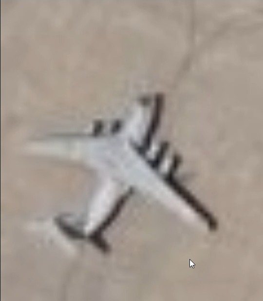
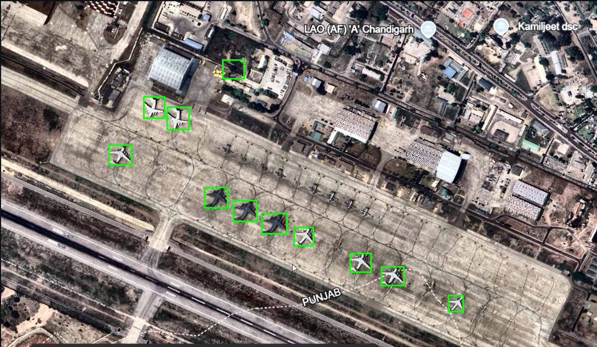

# Pattern based object detection prototype for Aerial Reconnassiance

This project is a Streamlit-based prototype for pattern-based object detection in aerial or satellite imagery. It allows users to upload a "pattern" (support) image and a "query" (scene) image, annotate the pattern, and then detect similar objects in the query image using advanced segmentation and embedding techniques.

## Features

- **Image Upload:** Upload both a pattern image (object of interest) and a query image (scene to search).
- **Image Enhancement:** Apply contrastive filters (CLAHE) and edge detection (Canny, Sobel, Laplacian, Scharr) to enhance images before annotation or detection.
- **Annotation:** Draw rectangles, circles, polygons, or freehand shapes on the pattern image to specify the object of interest.
- **Segmentation (SAM):** Use Meta's Segment Anything Model (SAM) to segment the annotated object region.
- **Embedding (DINOv2):** Extract feature embeddings from the segmented object using DINOv2 for robust pattern matching.
- **Query Segmentation & Detection:** Segment the query image, extract embeddings for each segment, and compare them to the pattern embedding to find similar objects.**(Cosine Similarity, L2 Distance)**
- **Non-Maximum Suppression (NMS):** Filter overlapping detections for cleaner results.
- **Visualization:** View detected objects, their bounding boxes, and download results as a CSV file.

## Sample Input Image



## Output Image



## Requirements

- Python 3.8+
- See `requirements.txt` for all dependencies.

### Key Dependencies

- streamlit
- streamlit-drawable-canvas
- torch
- torchvision
- transformers
- opencv-python
- pillow
- matplotlib
- scikit-image
- pandas

## Setup

1. **Clone the repository and navigate to the project folder:**
   ```bash
   git clone <repo-url>
   cd AIR
   ```

2. **Install dependencies:**
   ```bash
   pip install -r requirements.txt
   ```

3. **Download Model Weights:**
   - Place the `sam_vit_h.pth` file (Segment Anything Model weights) in the project root.  
     (Already present in this repo as per the file list.)

4. **Run the Streamlit app:**
   ```bash
   streamlit run app.py
   ```

5. **Open your browser to the provided local URL (usually http://localhost:8501).**

## Usage

1. **Upload Images:**  
   Use the sidebar to upload a pattern image (object of interest) and a query image (scene).

2. **Enhance Images (Optional):**  
   Apply contrast or edge filters to improve annotation and detection.

3. **Annotate Pattern:**  
   Draw a rectangle or other shape around the object in the pattern image.

4. **Segment with SAM:**  
   Click "Run SAM Segmentation on Bounding Boxes" to segment the annotated object.

5. **Extract Embedding:**  
   Click "Extract Object Embedding (DINOv2)" to generate a feature vector for the object.

6. **Detect in Query Image:**  
   Click "Segment Query Image with SAM and Compare Embeddings" to find similar objects in the query image.

7. **Review Results:**  
   View detected objects, adjust the L2 distance threshold, and download bounding box results as a CSV.

## File Structure

```
AIR/
  app.py                  # Main Streamlit app
  requirements.txt        # Python dependencies
  sam_vit_h.pth           # SAM model weights (2.4GB)
  photos/                 # Example images and screenshots
  AIR FORCE PROJECT video.mp4 # (Optional) Demo video
```

## Notes

- The app uses GPU if available (CUDA), otherwise falls back to CPU.
- The SAM and DINOv2 models are loaded on demand and cached for efficiency.
- For best results, use high-quality, well-cropped pattern images and query images of similar scale.

## References

- [Segment Anything Model (SAM)](https://github.com/facebookresearch/segment-anything)
- [DINOv2](https://github.com/facebookresearch/dinov2)
- [Streamlit](https://streamlit.io/)

## License

This project is for research and prototyping purposes. Please check the licenses of the underlying models (SAM, DINOv2) for any usage restrictions. 
